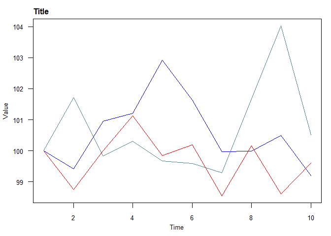

### What is finr

finr is a set of helper functions targeting mainly - but not only - people that do research in finance.

### Functions that are included in finr:

**1. rebase**

This function "rebases" any sequence of numbers at a specific point to a specific number. By default, it rebases any sequence of numbers to  100 at the first element. If a dataframe, matrix or xts object is passed then the rebase is applied to every column.

This is helpful when we want our time series to start from the same value for the starting point. The starting point can be different than 1, e.g. all the time series can be rebased to 100 in the 10th element.


```r
df <- data.frame(a = 101* (1 + rnorm(10)/100), b = 102 * (1 + rnorm(10)/100), c = 103 * (1 + rnorm(10)/100))
print(df)
```

```
##            a        b        c
## 1  100.78091 102.1606 101.9716
## 2  100.19533 100.8884 103.7141
## 3  101.73917 102.1545 101.8017
## 4  102.00160 103.3098 102.2877
## 5  103.71592 101.9945 101.6324
## 6  102.42728 102.3572 101.5466
## 7  100.75596 100.6638 101.2418
## 8  100.76477 102.3308 103.6714
## 9  101.28344 100.7327 106.0840
## 10  99.96438 101.7595 102.4962
```

```r
df_rebased <- finr::rebase(df)
print(df_rebased)
```

```
##               a         b         c
##  [1,] 100.00000 100.00000 100.00000
##  [2,]  99.41896  98.75475 101.70873
##  [3,] 100.95084  99.99404  99.83337
##  [4,] 101.21123 101.12494 100.30996
##  [5,] 102.91228  99.83746  99.66729
##  [6,] 101.63361 100.19248  99.58315
##  [7,]  99.97524  98.53494  99.28428
##  [8,]  99.98399 100.16665 101.66687
##  [9,] 100.49864  98.60235 104.03284
## [10,]  99.18980  99.60744 100.51439
```

**2. plot_df**

plot_df will plot all the variables (i.e. columns) of a dataframe, matrix or xts object in 1 chart. The plotting functionality is basic at the moment but saves time to the user.

```r
df_rebased_2 <- cbind(x = 1:10, df_rebased)
print(df_rebased_2)
```

```
##        x         a         b         c
##  [1,]  1 100.00000 100.00000 100.00000
##  [2,]  2  99.41896  98.75475 101.70873
##  [3,]  3 100.95084  99.99404  99.83337
##  [4,]  4 101.21123 101.12494 100.30996
##  [5,]  5 102.91228  99.83746  99.66729
##  [6,]  6 101.63361 100.19248  99.58315
##  [7,]  7  99.97524  98.53494  99.28428
##  [8,]  8  99.98399 100.16665 101.66687
##  [9,]  9 100.49864  98.60235 104.03284
## [10,] 10  99.18980  99.60744 100.51439
```

```r
finr::plot_df(df_or_mat = df_rebased_2, x_axis_var = "x", main_title = "Title", y_label = "Value", x_label = "Time")
```

<!-- -->

